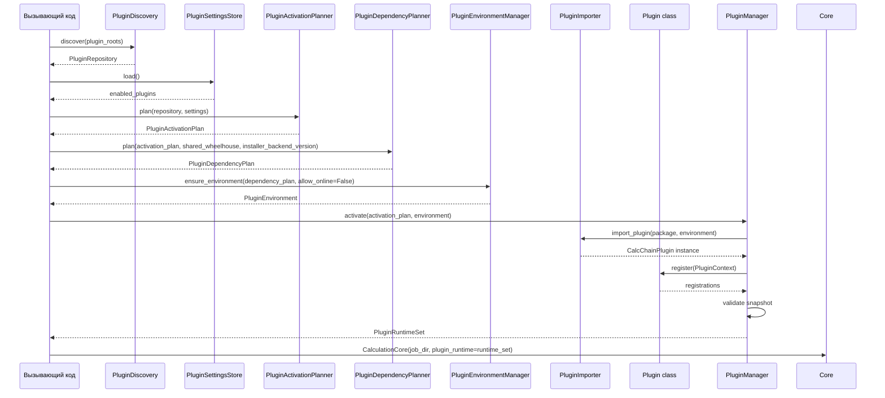

# Система плагинов CalcChain: текущая версия

Документ описывает текущее состояние системы плагинов CalcChain после инфраструктурного этапа реализации. Сейчас модуль решает задачи обнаружения, проверки, планирования, подготовки окружения, импорта и атомарной активации плагинов. Интеграция возможностей плагинов в рабочий цикл `CalculationCore` выполняется через явный bootstrap: вызывающий код получает `PluginRuntimeSet` и передает его в `CalculationCore`. CLI/UI для управления плагинами пока не реализованы.

## Общая схема

```mermaid
flowchart LR
    subgraph PluginPackage["Пакет плагина"]
        Manifest["plugin.json"]
        Code["Python package"]
        Requirements["requirements.txt"]
        Wheels["wheels/ + wheels.lock.json"]
    end

    subgraph Discovery["Обнаружение и репозиторий"]
        Reader["PluginMetadataReader"]
        Validator["PluginValidator"]
        Repository["PluginRepository"]
    end

    subgraph Planning["Планирование"]
        Settings["PluginSettingsStore"]
        ActivationPlanner["PluginActivationPlanner"]
        DependencyPlanner["PluginDependencyPlanner"]
        ActivationPlan["PluginActivationPlan"]
        DependencyPlan["PluginDependencyPlan"]
    end

    subgraph Environment["Окружение зависимостей"]
        Hash["env_hash"]
        EnvManager["PluginEnvironmentManager"]
        EnvLock["plugin-env.lock.json"]
        SitePackages["plugin_envs/<env_hash>/site-packages"]
    end

    subgraph Activation["Импорт и активация"]
        Importer["PluginImporter"]
        Manager["PluginManager"]
        DraftRegistry["fresh CapabilityRegistry"]
        RuntimeSet["PluginRuntimeSet"]
    end

    Manifest --> Reader --> Validator --> Repository
    Code --> Importer
    Requirements --> DependencyPlanner
    Wheels --> DependencyPlanner
    Settings --> ActivationPlanner
    Repository --> ActivationPlanner --> ActivationPlan
    ActivationPlan --> DependencyPlanner --> DependencyPlan
    DependencyPlan --> Hash --> EnvManager
    EnvManager --> EnvLock
    EnvManager --> SitePackages
    SitePackages --> Importer
    Importer --> Manager
    Manager --> DraftRegistry --> RuntimeSet

    RuntimeSet --> Core["CalculationCore(plugin_runtime=...)"]
```



## Назначение модуля

Система плагинов вводит контролируемый способ подключать расширения к CalcChain без изменения основного кода приложения. На текущем этапе она создает инфраструктурный слой: валидирует описание плагинов, строит план активации, проверяет зависимости, готовит изолированное `site-packages`, импортирует код плагина и фиксирует зарегистрированные возможности только после полной успешной проверки.

Модуль решает следующие задачи:

- обнаружение установленных плагинов по `plugin.json`;
- хранение пользовательского набора включенных плагинов;
- проверка совместимости с версией Plugin API и Python;
- предварительное обнаружение конфликтов заявленных возможностей;
- проверка требований и wheel lock-файлов;
- вычисление воспроизводимого хеша окружения;
- сборка или переиспользование окружения зависимостей;
- безопасная с точки зрения состояния активация: либо весь набор плагинов активирован, либо активное состояние не меняется;
- формирование диагностик с редактированием чувствительных данных по шаблонам.

## Текущие границы

Плагины считаются доверенным in-process кодом. CalcChain не пытается изолировать вредоносный Python-код, запрещать доступ к приватным объектам процесса или выполнять sandboxing. Ответственность за безопасность сторонних плагинов лежит на вызывающей стороне или организации, которая их устанавливает.

При этом система защищает собственные публичные инварианты: валидирует метаданные до импорта, проверяет хеши wheel-файлов, строит окружение по lock-материалам, не коммитит частично активированный runtime set и не раскрывает плагину низкоуровневые mutable-реестры.

## Публичные точки входа

Для авторов плагинов канонический импорт:

```python
from calcchain_core.plugin_api import CalcChainPlugin, PluginContext
```

Корневой пакет `calcchain_core` экспортирует только узкую публичную поверхность для авторов плагинов: `PLUGIN_API_VERSION`, `CalcChainPlugin`, `PluginContext` и публичные ошибки. Он не экспортирует `PluginManager`, runtime set, registry/registrar internals и инфраструктурные классы.

Для кода приложения и инфраструктуры используется пакет:

```python
from calcchain_core.plugins import activate_plugins
```

`activate_plugins(...)` является caller-facing helper для штатного explicit flow. Он последовательно вызывает discovery, загрузку settings, activation planning, dependency planning, environment preparation и `PluginManager.activate(...)`, возвращая `PluginRuntimeSet`. Более низкоуровневые классы discovery, repository, settings, activation planner, dependency planner, environment lock, environment manager, importer и manager также остаются лениво экспортированными из `calcchain_core.plugins`.

```python
from pathlib import Path

from calcchain_core import CalculationCore
from calcchain_core.plugins import activate_plugins


runtime_set = activate_plugins(
    [Path("plugins")],
    Path("plugins.json"),
    Path("plugin_envs"),
)
core = CalculationCore(Path("job"), plugin_runtime=runtime_set)
```

`CalculationCore.__init__` не выполняет discovery, dependency install, import или activation самостоятельно. Без переданного `plugin_runtime` доступны только built-in capabilities, например `local`; bundled `svn` становится доступным только после явной активации плагина `calcchain.svn`.

## Структура пакета плагина

Минимальная ожидаемая структура:

```text
plugins/demo_plugin/
  plugin.json
  demo_plugin/
    __init__.py
    plugin.py
  requirements.txt
  wheels/
    wheels.lock.json
    dependency-1.0.0-py3-none-any.whl
```

`plugin.json` содержит обязательные поля:

```json
{
  "schema_version": "1",
  "plugin_id": "demo.plugin",
  "plugin_version": "1.0.0",
  "requires_plugin_api": ">=1.0,<2.0",
  "python_requires": ">=3.11",
  "entrypoint": "demo_plugin.plugin:DemoPlugin",
  "dependencies": {
    "mode": "wheels",
    "wheels_path": "wheels",
    "requirements": "requirements.txt"
  },
  "declared_capabilities": [
    { "namespace": "source", "id": "demo_source" }
  ]
}
```

`entrypoint` должен указывать на модуль внутри корня пакета плагина. На стадии discovery код плагина не импортируется.

Сейчас поддерживается только режим зависимостей `wheels`. `wheels.lock.json` содержит список wheel-файлов и их SHA-256:

```json
{
  "wheels": [
    {
      "file": "dependency-1.0.0-py3-none-any.whl",
      "sha256": "..."
    }
  ]
}
```

Имена wheel-файлов в lock-файле не могут быть абсолютными путями, drive-qualified путями или содержать path traversal.

## Компоненты

| Компонент | Ответственность |
| --- | --- |
| `PluginMetadataReader` | Читает `plugin.json` как UTF-8 и преобразует его в структурированные метаданные. |
| `PluginValidator` | Проверяет обязательные поля, формат entrypoint, режим зависимостей, declared capabilities и совместимость с базовыми правилами. |
| `PluginDiscovery` | Находит `plugin.json` в переданных корнях и формирует репозиторий установленных плагинов. |
| `PluginRepository` | Хранит immutable snapshot установленных `PluginPackage`, запрещает дубли `plugin_id`. |
| `PluginSettingsStore` | Читает и пишет JSON-настройки вида `{ "enabled_plugins": [...] }`. Отсутствующий файл означает пустой набор. |
| `PluginActivationPlanner` | Строит план активации из репозитория и настроек, проверяет отсутствующие id, дубли, совместимость и предварительные конфликты возможностей. |
| `PluginDependencyPlanner` | Строит план зависимостей, читает requirements и wheel lock, вычисляет материалы для окружения. |
| `PluginEnvironmentManager` | Создает или переиспользует `plugin_envs/<env_hash>`, проверяет wheel-хеши и lock-файл окружения. |
| `PluginImporter` | Импортирует entrypoint в контролируемом `sys.path`/`sys.modules` контексте, проверяет id, version и наличие `register`. |
| `PluginManager` | Вызывает `register(context)`, валидирует snapshot возможностей и атомарно коммитит новый `PluginRuntimeSet`. |
| `PluginRuntimeSet` | Immutable представление активного состояния: активные plugin id, окружение, snapshot возможностей и диагностики. |
| `PluginDiagnostic` | Единый формат диагностик по фазам discovery, planning, dependency, environment, import и activation. |

## Последовательность активации



## Политики и решения

### Доверенный код

Плагин выполняется внутри процесса CalcChain и считается доверенным расширением. Система не является sandbox для недоверенного Python-кода. Это решение соответствует корпоративной модели использования, где плагины обычно разрабатываются или проверяются внутри организации.

### Обнаружение без импорта

Discovery и validation работают только с `plugin.json` и файловой структурой. Код плагина импортируется только после успешного планирования и подготовки окружения.

### Явное включение

Наличие плагина на диске не означает автоматическую активацию. Включенные плагины задаются настройками `PluginSettingsStore` через список `enabled_plugins`.

### Репозиторий как источник установленных плагинов

Планирование опирается на `PluginRepository` и настройки, а не на повторное сканирование файловой системы. Это делает входные данные планирования явными и воспроизводимыми.

### Hash/lock-based окружения

Идентичность окружения определяется `env_hash`. В него входят версия Python runtime, версия Plugin API, активные id/версии плагинов, хеши requirements, версия installer backend и wheel lock-материалы. Окружение считается готовым только при наличии корректного `plugin-env.lock.json` и `site-packages`.

### Offline-first установка

`PipInstaller` вызывает `sys.executable -m pip install --target ...`. При `allow_online=False` используется `--no-index`, а источниками зависимостей являются plugin-local wheel directory и optional shared wheelhouse. Собственный resolver не реализован.

### Атомарная активация

Каждая активация идет через fresh draft registry. `PluginManager` вызывает `plugin.register(context)`, валидирует полученный snapshot, сверяет declared capabilities с фактическими регистрациями при наличии деклараций и коммитит новый active state только после полной успешной проверки всех плагинов. Если импорт, register или валидация падают, предыдущий `PluginRuntimeSet` остается активным.

### Фактическая регистрация важнее декларации

`declared_capabilities` в `plugin.json` используется для предварительной проверки и сверки на активации. Источником истины для runtime является то, что плагин реально зарегистрировал через `PluginContext`.

### Узкая поверхность API

Автор плагина получает только `PluginContext` с регистраторами `sources`, `targets`, `reports`, `auth`. Низкоуровневые mutable-реестры и менеджер активации не являются частью публичного API автора плагина.

### Диагностика и redaction

Ошибки проходят через публичную иерархию `PluginError` и формат `PluginDiagnostic`. Сообщения и details редактируются pattern-based redaction. Это снижает риск случайного раскрытия секретов, но не является полноценной DLP-системой.

## Регистрация возможностей

Плагин реализует класс с `plugin_id`, `plugin_version` и методом `register(context)`.

```python
from calcchain_core.plugin_api import CalcChainPlugin, PluginContext


class DemoPlugin(CalcChainPlugin):
    plugin_id = "demo.plugin"
    plugin_version = "1.0.0"

    def register(self, context: PluginContext) -> None:
        context.sources.register("demo_source", factory=build_source)
```

Регистраторы проверяют владельца регистрации и дубли в рамках пары `namespace:id`. Один и тот же `id` может существовать в разных namespace, например `source:demo` и `target:demo`.

Текущие namespaces:

- `source`;
- `target`;
- `report`;
- `auth`.

На текущей версии эти возможности фиксируются в runtime snapshot и подключаются к расчетному workflow только при явной передаче `PluginRuntimeSet` в `CalculationCore`.

## Сценарии использования

### 1. Установить плагин на диск

Пользователь или корпоративный deployment кладет директорию плагина в один из plugin roots. Внутри директории должен быть корректный `plugin.json`, Python package, requirements и wheel lock-материалы.

Результат: плагин становится обнаруживаемым, но еще не активным.

### 2. Обнаружить установленные плагины

Вызывающий код передает список корней в `PluginDiscovery.discover(plugin_roots)`. Discovery находит direct `plugin.json` под корнем или в дочерних директориях, валидирует метаданные и возвращает `PluginRepository`.

Ошибки на этом этапе не требуют импорта кода плагина.

### 3. Включить плагин

Настройки хранят только идентификаторы:

```json
{
  "enabled_plugins": ["demo.plugin"]
}
```

Если файл настроек отсутствует, набор включенных плагинов считается пустым.

### 4. Построить план активации

`PluginActivationPlanner` сверяет настройки с репозиторием. Он проверяет, что каждый включенный id установлен, что нет дублей, что плагин совместим с текущим Plugin API и Python, а также что declared capabilities не конфликтуют между собой.

Если план содержит blocking diagnostics, дальнейшая активация не должна выполняться.

### 5. Подготовить окружение зависимостей

`PluginDependencyPlanner` читает requirements и wheel lock-файлы, затем вычисляет dependency plan. `PluginEnvironmentManager` проверяет хеши wheel-файлов и создает окружение `plugin_envs/<env_hash>`.

Если окружение уже существует, имеет корректный `plugin-env.lock.json` и содержит `site-packages`, оно переиспользуется.

### 6. Активировать плагины

`PluginManager.activate(plan, environment)` импортирует entrypoint каждого плагина, создает экземпляр, вызывает `register(context)` и валидирует итоговый snapshot. После успешной проверки всех плагинов manager публикует новый `PluginRuntimeSet`.

Если один из плагинов не импортируется, бросает исключение в `register` или регистрирует возможности, не совпадающие с декларацией, активация откатывается целиком.

### 7. Обработать ошибку hash mismatch

Если wheel-файл не совпадает с SHA-256 из `wheels.lock.json`, environment build завершается диагностикой. Плагин не импортируется, active runtime set не меняется. Исправление должно происходить через обновление wheel-файла или lock-файла в trusted supply chain.

### 8. Обработать ошибку register

Если `register(context)` выбрасывает исключение, manager превращает сбой в plugin diagnostic, сохраняет предыдущий active state и не публикует частично заполненный registry.

### 9. Переиспользовать окружение

При повторном запуске с тем же набором активных плагинов, теми же версиями, requirements, wheel lock-материалами, Plugin API и installer backend вычисляется тот же `env_hash`. Если lock окружения валиден, зависимости не устанавливаются повторно.

### 10. Отключить плагин

Вызывающий код удаляет id из `enabled_plugins` и строит новый activation plan. Следующая успешная активация публикует runtime set без этого плагина. Удаление старого окружения из `plugin_envs` пока является отдельной задачей обслуживания.

## Диагностика

Диагностика привязана к фазам:

- discovery;
- planning;
- dependency;
- environment;
- import;
- activation.

Сообщения должны позволять понять, какой плагин и какая фаза вызвали сбой. Неизвестные исключения из кода плагина оборачиваются в публичные plugin errors с сохранением внутренней причины для вызывающего кода.

## Текущие ограничения и не-цели

- Нет sandboxing для недоверенного кода.
- Нет implicit activation в `CalculationCore`; runtime capabilities подключаются только через явно переданный `PluginRuntimeSet`.
- Нет CLI/UI для управления плагинами.
- Нет persistent credential store или UI prompts; текущие credentials остаются runtime-only.
- Нет обязательного real SVN/network gate в regression suite; SVN покрыт fake-client/plugin-level тестами.
- Нет миграции или расширения пользовательского config-формата за пределами `PluginSettingsStore`.
- Нет собственного dependency resolver.
- Redaction остается pattern-based.
- `plugin_id` пока используется как opaque repository key без отдельной грамматики идентификатора.
- Путь к settings-файлу задается вызывающим кодом, global allowlist путей не реализован.
- Очистка устаревших окружений `plugin_envs` не входит в текущий модуль.
- Deferred future work: SVN target temp-file write-failure cleanup hardening остается вне текущего набора стадий.

## Проверенное поведение

Текущая реализация покрыта полной core regression suite и локальным manual demo без сетевых операций. Последняя зафиксированная проверка:

```text
python -m unittest discover -s tests -p "test_core_*.py"
Ran 198 tests in 5.780s
OK

1..20 | ForEach-Object { "" } | python examples/test_workspace/run_demo.py
local build/run/publish/restore/cleanup demo completed successfully
```

Эти проверки подтверждают поведение public API, metadata/discovery, activation planning, dependency/environment flow, importer/manager, source/target lifecycle, runtime auth bridge, report runtime, explicit bootstrap и local end-to-end flow на текущем этапе.
