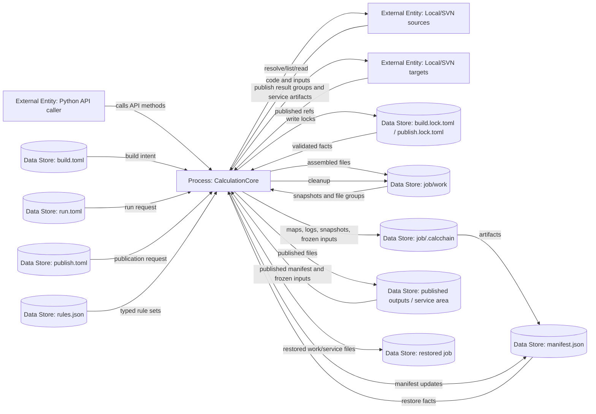

# CalcChain: текущее состояние проекта

## 1. Назначение

CalcChain сейчас состоит из двух частей:

- legacy-модулей `workspace_management` и `svn`, которые обслуживают старый workspace flow через CLI;
- нового ядра `calcchain_core`, которое реализует первый полный Python API цикл одного локального расчета: build, run, publish, restore и cleanup.

Новый внешний контракт первой версии - Python API. CLI в `main.py` пока относится к legacy flow и не является оболочкой над новым `calcchain_core`.

## 2. Legacy-часть проекта

### 2.1. CLI

Файл: `main.py`

Текущие команды:

- `init-ws`
- `check-ws`
- `save-results`

CLI создает `workspace_management.WorkspaceManager` и работает со старым форматом рабочей области.

### 2.2. WorkspaceManager

Файл: `workspace_management/manager.py`

`WorkspaceManager` обслуживает старый сценарий:

- читает `config.toml`;
- загружает исполняемые файлы и входные данные;
- читает `rules.json`;
- создает `config.lock.toml`;
- считает SHA-256 файлов рабочей области;
- сохраняет `info.json`;
- проверяет изменения файлов;
- читает `commit_config.toml`;
- выгружает результаты через file handlers.

Legacy flow не является новым ядром расчета: он не использует `build.toml`, `run.toml`, `publish.toml`, `manifest.json` нового формата и не предоставляет фасад `CalculationCore`.

### 2.3. File handlers

Файлы:

- `workspace_management/file_handlers/base.py`
- `workspace_management/file_handlers/local.py`
- `workspace_management/file_handlers/svn.py`
- `workspace_management/file_handlers/__init__.py`

Поддерживаемые handler-типы:

- `local` - локальная файловая система;
- `svn` - SVN через пакет `svn`.

Абстракции legacy-части:

- `BaseLoader` загружает файлы в workspace;
- `BaseRecorder` выгружает файлы из workspace;
- `LocalLoader` / `LocalRecorder` работают с локальными директориями;
- `SvnLoader` / `SvnRecorder` работают через SVN.

### 2.4. Rules и mapping

Файлы:

- `workspace_management/mapping/trans_map.py`
- `workspace_management/mapping/search_files.py`

Механика правил использует regex source patterns и destination templates. Поддерживаются маркеры вроде `<capt:...>`, `<path:name>`, `<path:stem>`, `<path:parent>`, `<source:desc>` и `<>`.

Эта legacy-механика также используется новым ядром через `calcchain_core/rules.py`, но новые форматы правил и статусы rule usage живут в `calcchain_core`.

### 2.5. SVN package

Файлы:

- `svn/src/client.py`
- `svn/src/commander.py`
- `svn/src/data_structures.py`
- `svn/src/exception.py`
- `svn/src/config.py`

Пакет `svn` содержит обертку над SVN CLI. Новый `calcchain_core` использует этот пакет для SVN source/target adapters.

### 2.6. Legacy-тесты

Legacy tests находятся в:

- `workspace_management/test/`
- `svn/test/`

Часть legacy tests устарела относительно текущей структуры кода. В workflow нового ядра основной проверяемый набор - `tests/test_core_*.py`.

## 3. Новое ядро `calcchain_core`

Новый пакет `calcchain_core` реализует воспроизводимый цикл одного расчета через Python API.

Основной фасад:

- `calcchain_core.api.CalculationCore`

Основные публичные операции:

- `create_build_lock()`
- `validate_build()`
- `build(dry_run=False)`
- `run()`
- `create_publish_lock()`
- `publish(dry_run=False)`
- `restore(RestoreRequest(...))`
- `cleanup(dry_run=False)`

### 3.1. Форматы нового ядра

Новые пользовательские и служебные форматы:

- `build.toml` - пользовательское описание code/input sources;
- `build.lock.toml` - зафиксированный build lock;
- `run.toml` - команда запуска, cwd, timeout, env и stdin-настройки;
- `publish.toml` - service target и result targets;
- `publish.lock.toml` - зафиксированные publish targets;
- `rules.json` - typed rule sets;
- `manifest.json` - фактический manifest расчета.

Local refs в новом ядре используют только `path`. SVN refs используют `location`, `path` и `revision`. Секреты моделируются names-only: значения secret env не записываются в config/manifest.

### 3.2. Основные модули нового ядра

- `models.py` - dataclass-модели форматов.
- `config.py` - чтение/запись TOML/JSON.
- `layout.py` - layout job/service/work/publication зон.
- `hash.py` - SHA-256 helpers.
- `sources.py` - source adapters and plugin-aware source registry; built-in `local` остается базовым adapter-ом, plugin-owned source capabilities подключаются через `PluginRuntimeSet`.
- `rules.py` - typed rules поверх существующего regex mapping.
- `build_plan.py` - создание и валидация build lock/plan.
- `builder.py` - сборка `work/`, maps, snapshots, frozen inputs.
- `snapshot.py` - file snapshots.
- `frozen_inputs.py` - фиксация измененных input files.
- `run_config.py` - run config parsing.
- `runner.py` - запуск процесса через argv-list с `shell=False`.
- `output_classifier.py` - классификация outputs/logs/temp/ignored/unknown.
- `manifest.py` - запись manifest после build/run/publish.
- `targets.py` - target adapters and plugin-aware target registry; built-in `local` остается базовым adapter-ом, plugin-owned target capabilities подключаются через `PluginRuntimeSet`.
- `publish.py` - publish lock, publish plan, manifest-last publication.
- `restore.py` - restore по manifest.
- `cleanup.py` - безопасная очистка `work/`.
- `plugin_runtime.py` - public runtime contracts для source/target/auth/report adapter authors.
- `auth.py` - runtime-only `AuthService`, `CredentialPolicy`, `NoAuthService` и auth errors.
- `plugins/` - plugin infrastructure: discovery, settings, activation planning, dependency environment, controlled import, manager and registrars.
- `api.py` - публичный фасад `CalculationCore`.

### 3.3. Plugin runtime integration status

Plugin infrastructure уже подключается к `calcchain_core` lifecycle частично, stage-gated по текущему run `run-20260515-140342`.

Завершено и одобрено:

- Runtime API contracts:
  - `SourceAdapter`, `TargetAdapter`, `AuthAdapter`, `ReportAdapter`;
  - `SourceContext`, `TargetContext`, `AuthContext`, `ReportContext`;
  - `AuthRequirement`, `AuthField`, `AuthCredentials`, `PublishedRef`, report value objects;
  - public exports через `calcchain_core.plugin_api`.
- Dynamic source/target refs:
  - `SourceRef` / `TargetRef` используют строковый `type`;
  - unknown plugin-specific fields сохраняются при parse/serialize;
  - `plugin.id` / `plugin.version` metadata поддерживается рядом с refs;
  - local validation и SVN userinfo rejection сохранены.
- Plugin-aware registries:
  - `SourceRegistry` / `TargetRegistry` используют string-keyed lookup;
  - default registries содержат built-in `local`, но больше не регистрируют hidden default `svn`;
  - `SourceRegistry.from_runtime(...)` / `TargetRegistry.from_runtime(...)` строят plugin-owned entries из `PluginRuntimeSet.capabilities`;
  - runtime capabilities не могут перезаписать уже зарегистрированные built-in entries.
- Source lifecycle integration:
  - build lock creation использует `validate_config -> resolve_lock_ref -> validate_lock_ref`;
  - plugin-owned source refs проходят build lock, build validation, build execution, frozen inputs, maps, manifest and restore;
  - frozen input versionability определяется через `registry.is_versionable(source)`;
  - plugin source adapter exceptions оборачиваются и редактируются.
- Target lifecycle integration:
  - publish lock creation использует `validate_config -> resolve_lock_ref -> validate_lock_ref`;
  - plugin-owned target refs проходят publish lock, publish planning, target writes, publication facts and manifest update;
  - adapter-returned `PublishedRef.source` сохраняется в publication facts as `published_sources[target_path]`;
  - restore использует `published_sources[target_path]`, если они есть, и сохраняет fallback для старых manifests;
  - manifest-last and dry-run semantics сохранены;
  - secret-like target extra fields редактируются в runtime target adapter errors.
- Auth runtime bridge:
  - `AuthService.from_runtime(...)` является explicit app/activation-layer helper;
  - `CalculationCore` не создает auth service автоматически из `plugin_runtime`;
  - caller может явно передать `auth_service`;
  - без explicit auth service source/target contexts получают `NoAuthService`, который безопасно возвращает `AuthError("auth service is not configured")`;
  - `AuthRequirement` следует documented shape: `scheme`, `scope`, `fields`, `persistence`, `optional`;
  - `AuthField.secret` управляет redaction auth diagnostics;
  - `AuthCredentials` остается runtime-only и redacted.

Еще не завершено в текущем staged run:

- bundled SVN migration на activated `calcchain.svn`;
- report runtime;
- explicit bootstrap/helper flow;
- final hardening/regression.

### 3.4. Принцип работы нового ядра

Новый цикл разделяет пользовательское намерение, lock-файлы, рабочую область и фактический manifest.

1. `create_build_lock()` читает `build.toml`, проверяет source refs через source registry/adapter contracts и создает `build.lock.toml`.
2. `validate_build()` валидирует lock и rules, строит build plan.
3. `build()` собирает `job/work`, пишет build maps, build snapshot и служебные artifacts.
4. `run()` делает pre-run check, фиксирует frozen inputs при ручных изменениях input files, запускает процесс и пишет manifest.
5. `publish()` читает `publish.toml`, создает `publish.lock.toml`, публикует outputs/logs/service artifacts через target registry/adapter contracts и пишет manifest последним.
6. `restore()` читает опубликованный или локальный `manifest.json`, восстанавливает файлы и проверяет hashes/tree hashes. Если publication facts содержат adapter-returned `published_sources`, restore использует их как источник.
7. `cleanup()` удаляет только `job/work`, сохраняя `job/.calcchain`.

Restore не читает `build.toml`, `run.toml` или `publish.toml`; источником фактов является manifest и вложенные в него maps/sources/artifacts. Для frozen inputs restore может использовать опубликованную service-копию, если original job-local frozen input уже недоступен.

### 3.5. DFD нового ядра



## 4. Текущие гарантии и ограничения нового ядра

Текущие гарантии:

- local refs используют `path` only;
- SVN refs валидируются на traversal/absolute path и userinfo credentials;
- run выполняется через argv-list и `shell=False`;
- timeout/cancel containment покрывает child processes с унаследованными stdout/stderr pipes;
- secret env хранится как names-only;
- manifest writer отклоняет credential-bearing SVN URLs;
- default source/target registries больше не включают hidden default `svn`;
- source/target plugin capabilities подключаются только через explicit `PluginRuntimeSet`;
- auth runtime доступен source/target adapter-ам только через explicit `auth_service`; `CalculationCore` не создает auth providers автоматически из `plugin_runtime`;
- `NoAuthService` дает безопасную ошибку, если adapter запрашивает credentials без настроенного auth service;
- `AuthCredentials` является runtime-only объектом с redacted `str()` / `repr()`;
- publish пишет manifest последним;
- restore service artifact writes ограничены `target_job_dir/.calcchain`;
- cleanup удаляет только `work/` и сохраняет service area.

Текущие ограничения:

- новый core не подключен к legacy CLI;
- GUI отсутствует;
- chains отсутствуют;
- persistent credential store, UI prompts/callbacks, OS credential managers и credential cleanup policy не реализованы;
- bundled SVN adapter еще не мигрирован на activated plugin/auth context flow;
- report runtime еще не подключен к manifest flow;
- integrity assessment block отсутствует;
- real SVN/network publish/restore в workflow не прогонялся; покрытие использует unit tests, local flow и adapter-level behavior;
- manifest provenance/trust policy находится вне текущей реализации.

## 5. Тестовое окружение `examples/test_workspace`

Папка:

- `examples/test_workspace`

Назначение: ручная проверка работоспособности нового `calcchain_core` через публичный `CalculationCore`.

Запуск из корня репозитория:

```powershell
python examples/test_workspace/run_demo.py
```

Что делает `run_demo.py`:

- пересоздает runtime-директории `job/`, `published_service/`, `published_outputs/`, `published_logs/`, `restored/`;
- пишет `build.toml`, `run.toml`, `publish.toml`, `rules.json` с абсолютными путями текущей машины;
- выполняет `create_build_lock()`;
- выполняет `validate_build()`;
- выполняет `build()`;
- вручную меняет `job/work/input/mesh.txt`, чтобы проверить frozen inputs;
- выполняет `run()`;
- выполняет `publish(dry_run=True)` и `publish()`;
- удаляет original job-local frozen inputs;
- выполняет `restore(..., dry_run=True)` и `restore()` из `published_service/manifest.json`;
- выполняет `cleanup(dry_run=True)` и `cleanup()`.

Ожидаемый результат:

- `examples/test_workspace/published_outputs/value.txt` содержит `CHANGED MESH`;
- `examples/test_workspace/published_logs/solver.log` содержит `done`;
- `examples/test_workspace/published_service/manifest.json` существует;
- `examples/test_workspace/published_service/frozen_inputs/input/mesh.txt` существует;
- `examples/test_workspace/restored/work/results/value.txt` содержит `CHANGED MESH`;
- `examples/test_workspace/job/work/` очищен;
- `examples/test_workspace/job/.calcchain/` сохранен.

Статические исходники примера:

- `examples/test_workspace/sources/code/solver.py`
- `examples/test_workspace/sources/input/input/mesh.txt`

Runtime-папки можно удалять: следующий запуск `run_demo.py` создаст их заново.

## 6. Актуальная проверка нового ядра

Основной набор тестов нового ядра:

```powershell
python -m unittest discover -s tests -p "test_core_*.py"
```

На более раннем состоянии проекта core test suite проходил с результатом:

```text
Ran 85 tests ... OK
```

Для текущего staged plugin lifecycle work последовательно проходили focused проверки:

```powershell
python -m unittest tests.test_core_plugin_api tests.test_core_formats
python -m unittest tests.test_core_sources tests.test_core_publish tests.test_core_plugin_infrastructure
python -m unittest tests.test_core_build_plan tests.test_core_builder tests.test_core_restore tests.test_core_e2e
python -m unittest tests.test_core_publish tests.test_core_e2e tests.test_core_restore
python -m unittest tests.test_core_plugin_api tests.test_core_sources tests.test_core_publish
```

Последняя Stage 5 manager validation:

```text
Ran 44 tests ... OK
```

Для ручной smoke-проверки используется:

```powershell
python examples/test_workspace/run_demo.py
```
