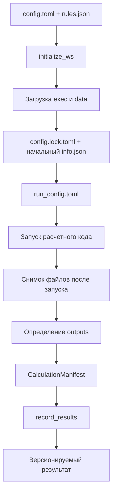
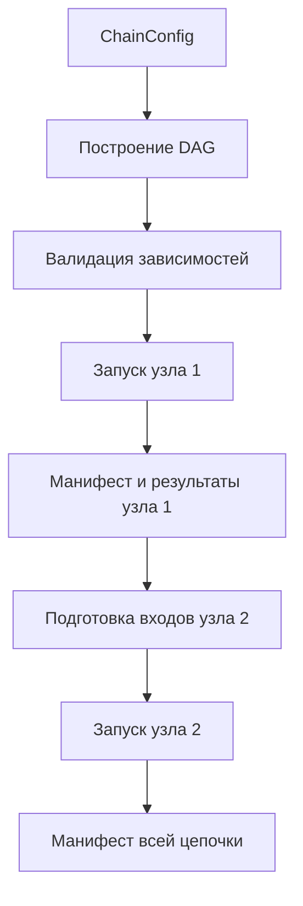

# CalcChain: текущее состояние и план развития

## 1. Назначение проекта

CalcChain должен стать портативным инструментом для оркестрации вычислительных цепочек. Базовый сценарий:

1. Загрузить из версионируемого источника, например SVN или Git, исполняемые файлы расчетного кода нужной версии.
2. По заранее заданным правилам подобрать и загрузить входные файлы для этого расчета.
3. Запустить расчет, зафиксировать состояние рабочей области до и после запуска и определить выходные файлы.
4. Сохранить выходные файлы в репозиторий так, чтобы они могли быть использованы как входные данные следующего расчета.

Ключевые свойства продукта:

- полная воспроизводимость каждого расчета;
- версионирование всех исполняемых, входных, конфигурационных и выходных файлов;
- возможность перепроверить расчет в любой момент;
- возможность исправлять цепочку с проблемного звена, не пересчитывая всю цепочку с нуля;
- в перспективе - параллельные и удаленные вычисления.

## 2. Текущее состояние `workspace_management`

Модуль `workspace_management` уже реализует основу локального менеджера рабочей области для одного расчета.

### 2.1. `WorkspaceManager`

Файл: `workspace_management/manager.py`

`WorkspaceManager` умеет:

- читать `config.toml`;
- загружать исполняемые файлы через `load_exec`;
- загружать входные данные через `load_data`;
- читать правила из `rules.json`;
- создавать `config.lock.toml`;
- считать SHA-256 хэши файлов рабочей области;
- сохранять метаданные в `info.json`;
- проверять изменение файлов через `check_hashes`;
- читать `commit_config.toml` и выгружать результаты через `record_results`;
- проверять, что при выгрузке в версионируемый источник исходные данные тоже были версионируемыми и не менялись.

Это уже закрывает важную часть воспроизводимости: после инициализации можно зафиксировать конкретные источники, ревизии и контрольные суммы.

Основное ограничение: менеджер пока не запускает расчетный код сам. Он готовит рабочую область и сохраняет результаты, но этап выполнения расчета и автоматическое определение новых выходных файлов еще не оформлены как отдельный контракт.

### 2.2. Загрузчики и выгрузчики файлов

Файлы:

- `workspace_management/file_handlers/base.py`
- `workspace_management/file_handlers/local.py`
- `workspace_management/file_handlers/svn.py`
- `workspace_management/file_handlers/__init__.py`

Есть абстракции:

- `BaseFileHandler` - общий контракт источника или приемника файлов;
- `BaseLoader` - загрузка файлов в рабочую область;
- `BaseRecorder` - выгрузка файлов из рабочей области;
- `LocalLoader` и `LocalRecorder` - работа с локальными директориями;
- `SvnLoader` и `SvnRecorder` - работа с SVN.

Плюсы текущей модели:

- тип источника выбирается через `type`;
- можно добавлять новые источники через новые наследники `BaseLoader` и `BaseRecorder`;
- SVN-источник считается версионируемым, локальный источник - нет;
- предусмотрена авторизация через callback и кеш credentials.

Ограничения:

- Git пока не реализован;
- регистрация обработчиков основана на `__subclasses__()` и явных импортах, что может стать хрупким при росте проекта;
- `LocalRecorder` требует пустую папку назначения, а `SvnRecorder` импортирует результаты в новую папку, но нет явной модели версии результата как сущности расчета;
- комментарий коммита, автор расчета, идентификатор запуска и связь с предыдущим расчетом пока не являются обязательной частью выгрузки.

### 2.3. Правила маппинга файлов

Файлы:

- `workspace_management/mapping/trans_map.py`
- `workspace_management/mapping/search_files.py`

Уже есть полезная механика правил:

- входной файл матчится регулярным выражением;
- путь назначения строится по шаблону;
- поддерживаются маркеры `<path:name>`, `<path:stem>`, `<path:parent>`, `<capt:...>`, `<source:desc>` и `<>`;
- можно требовать, чтобы все файлы источника были покрыты правилами.

Это хороший фундамент для загрузки входных данных и выгрузки результатов. Для цепочек расчетов стоит развить эту часть в сторону валидации правил до запуска, человекочитаемых ошибок и сохранения фактической карты перемещений файлов в метаданных расчета.

### 2.4. Конфигурации

Файл: `workspace_management/simple_config.py`

Реализован легковесный механизм конфигурационных dataclass-оберток:

- проверка обязательных полей;
- проверка лишних полей;
- проверка типов;
- вложенные конфигурации;
- `ConfigUnion` для объединения конфигураций источника и правил.

Это удобно для текущего размера проекта, но есть риски:

- часть типовых сценариев Python typing может быть обработана неполно;
- ошибки конфигурации сейчас ориентированы скорее на разработчика, чем на конечного пользователя;
- нет единого опубликованного формата `config.toml`, `rules.json`, `commit_config.toml` и будущих конфигов запуска.

### 2.5. Метаданные расчета

Файл: `workspace_management/info_data.py`

`info.json` сейчас хранит:

- пользователя;
- hostname;
- timestamp;
- список источников;
- хэши файлов.

Для первичной проверки целостности этого достаточно. Для полноценной цепочки расчетов потребуется расширить метаданные:

- идентификатор расчета;
- идентификатор родительского расчета или набора входных артефактов;
- команда запуска;
- код возврата процесса;
- stdout/stderr или ссылки на логи;
- карта входных файлов;
- карта выходных файлов;
- версии инструментов;
- статус расчета;
- причина ручного исправления или повторного запуска.

### 2.6. CLI

Файл: `main.py`

Есть команды:

- `init-ws`;
- `check-ws`;
- `save-results`.

CLI уже подходит для ручной проверки базового цикла: подготовить рабочую область, проверить изменение файлов, сохранить результаты.

Недостающие команды для целевого продукта:

- `run` - запустить расчет;
- `inspect` - показать состав расчета, источники, ревизии, хэши и статус;
- `reproduce` - пересоздать рабочую область по lock-файлам и метаданным;
- `chain plan` или `chain run` - выполнить цепочку расчетов;
- `resume-from` - продолжить цепочку с выбранного звена.

### 2.7. Тесты и документация

Есть `workspace_management/manager_doc.md`, но часть документации уже расходится с кодом. Например, документация упоминает `recorder_config.toml`, а код использует `commit_config.toml`.

Тесты в `workspace_management/test/` выглядят устаревшими:

- `test_manager.py` импортирует `PathNotFoundError` и `IncorrectDirectoryError`, которых сейчас нет в `manager.py`;
- `test_svn_tool.py` ссылается на `workspace_management.connectors.svn_tool`, которого в текущей структуре нет;
- нет актуальных тестов для `WorkspaceManager.initialize_ws`, `record_results`, `rules.json`, `ConfigUnion`, `LocalLoader`, `SvnLoader`, `LocalRecorder`, `SvnRecorder`.

Перед развитием функциональности тестовую базу стоит привести в актуальное состояние.

## 3. Главные архитектурные пробелы

1. Нет явной сущности "расчет".
   Сейчас рабочая область фиксируется, но расчет как процесс с входами, выходами, командой запуска и статусом не описан отдельной моделью.

2. Нет автоматического запуска расчетного кода.
   Целевой пайплайн требует запуска процесса и фиксации результата выполнения.

3. Нет надежного определения выходных файлов.
   Хэши помогают найти изменения среди уже известных файлов, но для результатов нужно различать входы, исполняемые файлы, логи, временные файлы и новые выходные артефакты.

4. Нет модели цепочки.
   Нужны связи между расчетами: какой результат какого звена стал входом следующего звена.

5. Нет Git-источника.
   Требование говорит про `svn | git`, сейчас фактически реализован SVN и локальная файловая система.

6. Нет стратегии повторного расчета с середины цепочки.
   Для этого нужны стабильные идентификаторы артефактов, зависимостей и расчетных узлов.

7. Недостаточно актуальных тестов.
   Перед крупными изменениями нужно зафиксировать существующее поведение.

## 4. Рекомендуемое направление развития

Двигаться стоит не сразу к параллельности или gRPC, а к строгой локальной модели одного расчета. Если один расчет будет полностью воспроизводимым, цепочки и удаленный запуск станут естественным расширением.

### Этап 1. Стабилизировать текущий `WorkspaceManager`

Цель: сделать существующий локальный сценарий надежным и проверяемым.

Что сделать:

- актуализировать тесты под текущие классы исключений и структуру модулей;
- добавить тесты на `LocalLoader`, `LocalRecorder`, правила маппинга и `WorkspaceManager.initialize_ws`;
- синхронизировать `manager_doc.md` с кодом;
- зафиксировать формат `config.toml`, `rules.json`, `commit_config.toml`, `config.lock.toml`, `info.json`;
- улучшить сообщения ошибок для пользователя;
- проверить поведение dry-run;
- устранить расхождения имен, например `record`, `result`, `commit_config.toml`.

Результат этапа: подготовка и выгрузка рабочей области становятся покрытым тестами контрактом.

### Этап 2. Ввести модель одного запуска расчета

Цель: превратить рабочую область из набора файлов в воспроизводимый расчет.

Предлагаемые сущности:

- `RunConfig` - команда запуска, рабочая директория, переменные окружения, таймаут, правила классификации выходных файлов;
- `RunInfo` - статус, время старта и завершения, код возврата, stdout/stderr или пути к логам;
- `FileSnapshot` - путь, хэш, размер, время изменения, категория файла;
- `CalculationManifest` - полный манифест расчета: источники, lock-конфиг, входы, исполняемые файлы, выходы, команда запуска, статус.

Что сделать:

- добавить конфиг запуска, например `run_config.toml`;
- перед запуском сохранять snapshot рабочей области;
- запускать процесс через `subprocess`;
- после запуска сохранять второй snapshot;
- вычислять новые, измененные и удаленные файлы;
- классифицировать выходные файлы по правилам;
- сохранять `run_info.json` или расширенный `info.json`;
- добавить CLI-команду `run`.

Результат этапа: программа сама запускает расчет и формирует список выходных файлов.

### Этап 3. Сделать выгрузку результатов зависимой от манифеста

Цель: сохранять не "все подходящие файлы из папки", а именно результаты конкретного расчета.

Что сделать:

- передавать в recorder список файлов из `CalculationManifest.outputs`;
- сохранять рядом с результатами манифест расчета;
- запрещать выгрузку, если расчет не завершился успешно;
- запрещать выгрузку, если входы или исполняемые файлы изменились после lock-состояния;
- добавить понятный режим `dry-run`, который показывает, какие файлы и куда будут выгружены;
- добавить обязательное описание результата или commit message.

Результат этапа: результат расчета становится версионируемым артефактом с доказуемым происхождением.

### Этап 4. Добавить Git-источник

Цель: выполнить требование `svn | git`.

Что сделать:

- добавить `GitLoader` и `GitRecorder`;
- определить формат Git-конфига: URL, branch/tag/commit, path внутри репозитория;
- при загрузке фиксировать commit hash, а не плавающую ветку;
- при выгрузке явно задавать branch, commit message и стратегию создания папки результата;
- добавить тесты на локальный bare-репозиторий Git.

Результат этапа: источники и приемники становятся симметричными для SVN и Git.

### Этап 5. Ввести цепочки расчетов

Цель: описывать несколько расчетов и зависимости между ними.

Предлагаемая модель:

- `ChainConfig` - список узлов и зависимостей;
- `CalculationNode` - один расчет: источник exec, источники data, run config, result recorder;
- `ArtifactRef` - ссылка на версионируемый результат предыдущего расчета;
- `ChainManifest` - фактическое выполнение всей цепочки.

Что сделать:

- описать цепочку как DAG без циклов;
- валидировать, что входы каждого узла существуют;
- запускать узлы последовательно в порядке зависимостей;
- сохранять для каждого узла отдельный манифест;
- уметь пересобрать цепочку с выбранного узла;
- добавить CLI-команды для запуска и инспекции цепочки.

Результат этапа: появляется возможность исправлять цепочку с проблемного звена.

### Этап 6. Добавить кеширование и повторное использование результатов

Цель: не пересчитывать узлы, если их входы, исполняемый код и параметры не изменились.

Что сделать:

- вычислять стабильный fingerprint расчета;
- перед запуском искать существующий результат с таким fingerprint;
- разрешить политики `always-run`, `reuse-if-exists`, `force-from-node`;
- явно логировать, какой узел был пересчитан, а какой переиспользован.

Результат этапа: цепочка становится эффективной и управляемой.

### Этап 7. Подготовить параллельность

Цель: выполнять независимые узлы цепочки одновременно.

Что сделать:

- отделить планировщик цепочки от исполнителя;
- ввести интерфейс executor;
- сначала реализовать локальный executor;
- добавить параллельный локальный executor на базе независимых рабочих директорий;
- ограничивать число параллельных задач;
- изолировать временные файлы и логи каждого узла.

Результат этапа: независимые расчеты в DAG можно выполнять параллельно.

### Этап 8. Подготовить удаленное выполнение через gRPC

Цель: вынести выполнение тяжелых расчетов на удаленный сервер, не ломая локальную модель.

Что сделать:

- оставить `WorkspaceManager` ответственным за подготовку и валидацию данных;
- определить gRPC-контракт для передачи задания, манифеста, файлов или ссылок на артефакты;
- на сервере выполнять расчет в изолированной рабочей директории;
- возвращать манифест, логи и выходные файлы;
- добавить авторизацию и ограничения на команды запуска.

Результат этапа: локальный и удаленный запуск используют одну модель расчета.

## 5. Приоритет ближайших работ

Ближайший практичный порядок:

1. Привести тесты и документацию текущего `WorkspaceManager` в актуальное состояние.
2. Зафиксировать форматы конфигураций и lock-файлов.
3. Добавить запуск одного локального расчета и фиксацию output snapshot.
4. Перевести выгрузку результатов на манифест расчета.
5. Добавить Git.
6. После этого проектировать цепочки.

Не стоит начинать с gRPC или параллельности, пока нет строгого локального контракта одного расчета. Иначе удаленный запуск будет масштабировать неопределенность: неясные входы, неясные выходы и неполные метаданные.

## 6. Предлагаемый целевой поток одного расчета

## 7. Предлагаемый целевой поток цепочки

## 8. Критерии зрелости проекта

Проект можно считать готовым к использованию в реальных расчетных цепочках, когда выполняются условия:

- каждый расчет имеет полный манифест;
- каждый входной файл имеет источник, версию и хэш;
- каждый исполняемый файл имеет источник, версию и хэш;
- каждый выходной файл связан с конкретным расчетом;
- расчет можно воспроизвести из lock-файлов и манифеста;
- изменение входов или исполняемых файлов обнаруживается автоматически;
- цепочка хранит зависимости между расчетами;
- можно пересчитать цепочку с выбранного звена;
- тестами покрыты локальные, SVN и Git сценарии;
- ошибки конфигурации понятны пользователю без чтения кода.

